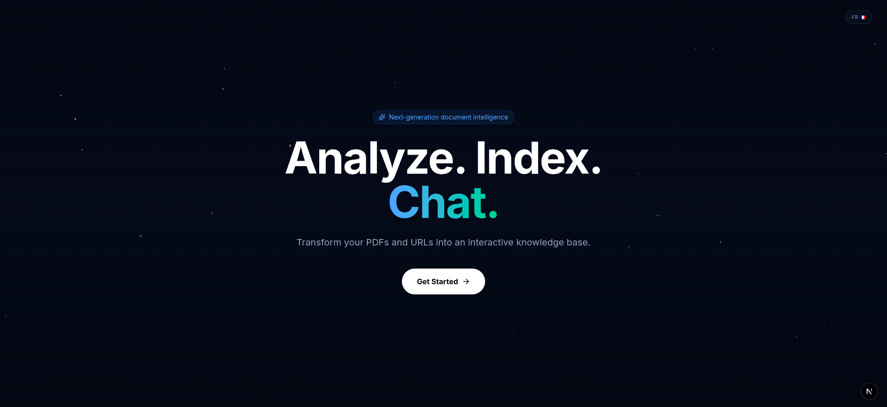
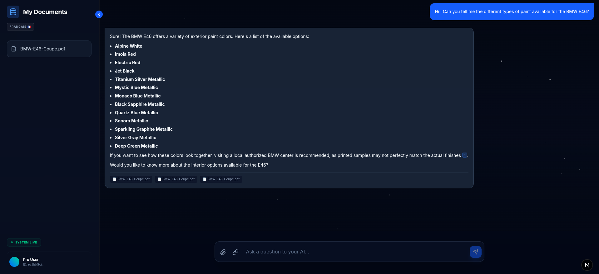
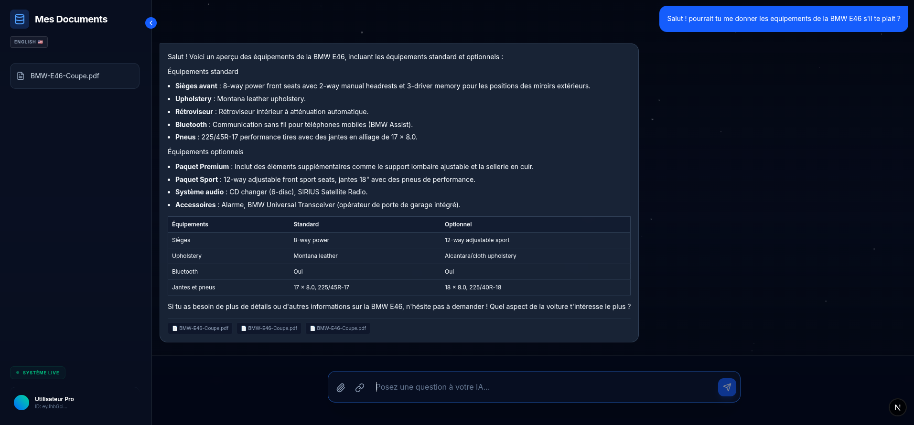

# 🌌 LuminAi UI

A high-fidelity, bilingual frontend for the **LuminAi** RAG platform. This interface provides a sophisticated, modern experience for interacting with personal knowledge bases, featuring real-time document analysis and seamless language switching.

## 📸 Screenshots

| Feature | English | French |
| :--- | :---: | :---: |
| **Landing Page** |  |  |
| **Chat Interface** |  |  |
| **Authentication** |  |  |

## ✨ Key Features

* **Dynamic Bilingual Support**: Instantly toggle between English and French across the entire UI using a centralized `LanguageContext`.
* **Intelligent RAG Chat**: Engage with your documents via an AI-powered interface that supports rich Markdown rendering, including tables and code blocks.
* **Source Citation System**: Every AI claim is backed by interactive citations that link directly to the specific document fragments used for the response.
* **Secure Auth Flow**: Elegant, bilingual login and registration modals with integrated JWT session management.
* **Collapsible Workspace**: A responsive sidebar to manage indexed PDFs and URLs with real-time system status indicators.
* **Premium Aesthetics**: Dark-mode "Glassmorphism" design featuring a dynamic, animated star-field background.

## 🛠 Tech Stack

* **Framework**: Next.js 15 (App Router)
* **Styling**: Tailwind CSS v4 with `@tailwindcss/typography`
* **Animations**: Framer Motion for smooth UI transitions and state changes
* **Icons**: Lucide React
* **Notifications**: Sonner for non-intrusive, styled toast feedback

## 🚀 Getting Started

### Prerequisites
* Node.js 18+
* A running instance of the **LuminAi Backend**

### Installation
1. Navigate to the UI directory:
   ```bash
   cd LuminAi-ui

##npm install
Configure your environment variables in .env.local:

Extrait de code

NEXT_PUBLIC_API_URL=http://localhost:8080/api
Launch the development server:

Bash

npm run dev

---

